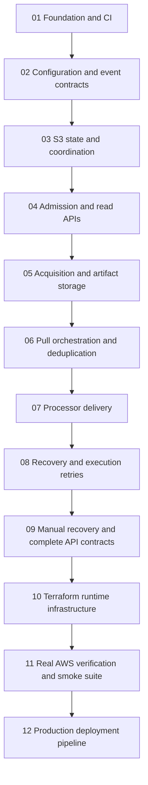
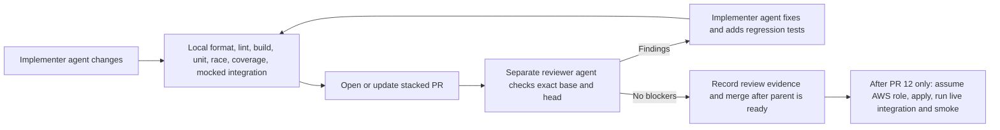

# Data Fetch Service — Stacked PR Implementation Plan

Date: 2026-09-27
Repository: https://github.com/maverickuser/data-fetch-service
Source of truth: [Data Puller Service LLD](../specs/data-puller-service-lld.md)
Implementation inputs: [Implementation Context Specification](data-fetch-service-implementation-context-spec.md)

## Objective and boundaries

Implement the agreed LLD incrementally in reviewable, dependent PRs. Every PR adds working, tested behaviour or concrete deployment infrastructure. This plan creates no repository, branches, PRs, or AWS resources by itself.

Preserve these decisions throughout the stack:

- Go and AWS SDK v2; five standard Lambda entry points: API, admission, pull, delivery, reconciler.
- Pin Go 1.27.1 across `go.mod`, CI, local tooling, and build images. Include Go 1.27 compatibility tests for JSON, timers/cancellation, race behaviour, and `linux/arm64` cross-compilation.
- Pin Terraform 1.16.4 (`required_version = "~> 1.16.4"`) and AWS provider 6.61.0; commit `.terraform.lock.hcl` and run plans with the pinned toolchain. Do not use the Terraform 1.17 beta for production.
- Service-owned ingress, pull, and delivery queues, each with a DLQ; CloudEvents 1.0 admission.
- BSE: Monday–Friday at 20:00 Asia/Kolkata; event supplies `exchangeName`; scheduled time determines the date. Download `DEBTBHAVCOPY{ddMMyyyy}.zip`, select only `fgroup{ddMMyyyy}.csv`, and store `{exchangeName}_fgroup{ddMMyyyy}.csv`.
- NSDL: one ISIN-bearing event invokes all six configured APIs and stores separate `{isin_code}_{job_id}.json` files.
- Complete-event manifest; compare with the last HTTP-202-accepted dataset; changed means deliver all files. Processor URL remains configurable.
- Three source attempts per job per run, three delivery attempts, and three automatic full-event retries after the initial Pull Lambda execution for crashes/timeouts. Business failures such as BSE 404 do not enter that execution retry chain.
- Immutable snapshots/history in S3, conditional coordination writes, recoverable dispatch, and 30-day run retention with a long-lived accepted baseline.
- Production only; GitHub Actions assumes the supplied role. `AWS_REGION` defaults to `ap-south-1`. Use the `data-fetch-service` resource prefix without account/region/environment suffixes.
- Optimise measured cost per completed event; batch latency is not a priority. Benchmark Lambda memory/duration, source retries, S3 state requests/recovery scans, queue operations, and logging at the initial 10,000-event burst. Retain reliability and ensure backlog drains within retention; lower concurrency alone is not proof of lower total cost.
- CI runs quality checks on pull requests. CD builds and deploys from `main` using Terraform, Docker, and AWS. GitHub Actions assumes a dedicated AWS role through OIDC using repository secret `AWS_ROLE_TO_ASSUME`; the trust provider is `https://token.actions.githubusercontent.com` with audience `sts.amazonaws.com`.

## Stack and release strategy

Use a linear stack initially. Branch `stack/01-foundation` targets `main`; each subsequent branch targets the preceding branch. Each PR should describe only its own increment, link its parent, and identify its acceptance checks. This avoids showing the entire stack as one review.

Merge bottom-up. After a parent merges, rebase the child onto the updated base, retarget its PR, and rerun checks. If squash merging, transplant only the child's commits; do not replay the already-merged parent's commits. Never treat results from the old head as validation of a rewritten head. All implementation, agent review/fix cycles, and deterministic tests run locally during PRs. Do not apply Terraform, create AWS resources, or call live production dependencies from intermediate PRs. Release activation belongs to PR 12, after the entire application is present.



### Local PR review loop



The review loop is agent-only by agreement. A reviewer must inspect the actual diff and rerun the local gates after fixes; a prior review result cannot be carried across a rewritten head. Intermediate PRs must remain runnable without AWS credentials and without live downstream calls. The final release is the first point at which deployment and real endpoint tests are allowed.

## Required checks on every PR

- Formatting, lint, configuration validation when available, and build checks for the code present in that PR.
- Unit statement coverage strictly greater than 95% across all authored production Go packages, including adapters and packages without tests. Compute the weighted ratio from the profile without rounding; exactly 95% fails. Exclude only explicit generated/vendor/test code. Integration coverage cannot inflate this gate.
- Race detector and deterministic failure-path unit tests. Add tests with each feature rather than deferring coverage to a final testing PR.
- Mocked API/integration tests grow with each implemented contract. Use real application logic and mock external boundaries. Run without AWS credentials or live dependencies on PRs.
- Terraform formatting/validation for infrastructure changes; run credentialed plans only in a trusted workflow context. Never execute untrusted PR code with production credentials.
- Upload test and coverage reports even on failure. Required GitHub branch checks enforce the gates; workflow YAML alone is not branch protection.
- Review each PR with two local agent passes: an implementer agent and a separate reviewer agent. The reviewer records findings against the exact base/head, the implementer fixes valid findings and adds regression tests, and the reviewer repeats until no blockers remain and all local gates pass. Human approval is not required by the agreed workflow; do not fabricate GitHub approval identity.
- Keep cloud-dependent checks deferred during implementation. Build and test their harnesses locally with deterministic fakes; execute real AWS/source/processor checks only in the final release workflow after the complete stack is ready.
- Documentation-only PRs need applicable document checks, not fabricated coverage. Incomplete feature scaffolding must not manufacture passing coverage or claim end-to-end readiness.

## Repository guidance for coding agents

PR 01 must make the repository self-contained for a new human or coding agent. Follow the open AGENTS.md convention (https://github.com/agentsmd/agents.md): place concise project instructions at the repository root, with links to detailed specifications rather than duplicating them.

```text
AGENTS.md
README.md
docs/README.md
docs/specs/data-puller-service-spec.md
docs/specs/data-puller-service-lld.md
docs/specs/structured-file-processing-spec.md
docs/plans/data-fetch-service-implementation-plan.md
docs/plans/implementation-status.md
docs/decisions/README.md
```

Copy the existing specification documents into the repository and repair relative links. Mark the older functional spec as historical where superseded by the LLD; the processor spec defines the external integration boundary, not extra implementation scope for this service. Do not fabricate missing source documents. The docs index must identify which files are authoritative, historical, or external references.

The root AGENTS.md must explain the service purpose, reading order, package map, exact implemented build/test commands, >95% unit coverage gate, mocked/live test separation, core data/retry invariants, and stacked-PR workflow. Introduce scoped `infra/AGENTS.md` only when infrastructure-specific instructions become useful; keep local guidance consistent with root instructions. Do not introduce competing copies for individual agent products.

Use `implementation-status.md` to record each planned PR's actual branch/link, state, verified checks, and blockers. Keep it factual; planned or mocked work must not be marked deployed or live-tested. Record substantive future design changes in short decision records and update the canonical LLD in the same PR. Link-check docs in CI, verify documented local commands, and update guidance whenever commands or architecture change.

The prepared `data-fetch-service-AGENTS.md` draft is to become root `AGENTS.md` in PR 01. Verify command names against the created Makefile before publishing it. Do not install service-specific instructions as `~/AGENTS.md`.

## PR 01 — Repository foundation and quality gates

Branch: `stack/01-foundation`; base: `main`. LLD: sections 4, 15–16.

- Initialize the Go module, pinned toolchain/dependencies, package conventions, local build/test commands, and repository documentation.
- Add root `AGENTS.md`, the complete specs/plan bundle and docs index, and a factual implementation-status table using the repository-guidance layout above. Repair links and document specification precedence. Add documentation link checks and verify the local commands advertised to agents.
- Add `docs/engineering/go-standards.md` and `docs/engineering/pr-review.md` using the prepared `data-fetch-service-pr-review-policy.md` proposal. Add a PR template, curated/pinned analysis tools, without a CODEOWNERS approval prerequisite. Configure feasible review protections during repository setup; document adopted Go rules and resolve company-guide differences explicitly.
- Make readability the primary standard. Require short purpose/contract comments above authored production functions and methods, including unexported helpers; review their accuracy and usefulness. Treat size/complexity metrics as review prompts rather than mandatory fragmentation thresholds.
- Add the first useful domain primitives: typed run states, identities, and errors. Introduce clock/ID interfaces with their first consuming application service. Avoid empty Lambda handlers and placeholder business logic.
- Add GitHub Actions format/lint/build/unit/race/coverage jobs and report artifacts; document required repository branch checks.
- Establish the unit suite and a coverage checker that instruments the full production package list. Add the separate mocked integration suite with the first implemented application boundary; do not fabricate a passing empty suite.

Exit evidence: clean local/CI build; greater-than-95% unit coverage; checker fixtures prove 95% fails, weighting is correct, and untested packages count. No AWS resources or deployment workflow are activated.

## PR 02 — Configuration, filenames, and event normalization

Branch: `stack/02-contracts`; base: PR 01. LLD: sections 3, 5–6.

- Implement typed YAML loading, overlays, validation, canonical config revision, and `cmd/configcheck`.
- Commit production configuration for BSE and all six NSDL jobs, the weekday schedule, resource budgets, and configurable processor target.
- Implement CloudEvents validation and native EventBridge/SQS input adapters, request/execution identities, logical-time normalization, and immutable snapshot construction.
- Resolve URL, ZIP member, and output filename templates; require safe `exchangeName` and valid ISIN input according to each event schema.

Exit evidence: tests for midnight-delayed schedules, preserved dates on retry, equivalent input normalization, reused IDs with changed payloads, BSE exchange-prefixed output, six NSDL filenames, and invalid variables/paths. Include golden payload/config fixtures.

## PR 03 — S3 state repository and conditional coordination

Branch: `stack/03-state`; base: PR 02. LLD: sections 7–8.

- Implement immutable conditional object creation, verified duplicate writes, history/listing/attempt records, and mutable coordination using ETag compare-and-swap.
- Implement recoverable transition intents, ownership tokens/generations/deadlines, request intents/resolutions, dispatch intent primitives, and accepted-baseline persistence.
- Implement run projection and retention-aware reads; separate retained compact metadata from expiring run objects.
- Add deterministic S3/queue boundary fakes that model conditional conflicts and injected failures, plus an AWS SDK adapter.

Exit evidence: concurrent writers converge; collisions with differing bytes fail; every transition write boundary can be interrupted and safely resumed; stale generations cannot commit. Real AWS verification follows in PR 11.

## PR 04 — Admission, durable dispatch, and initial REST reads

Branch: `stack/04-admission`; base: PR 03. LLD: sections 6, 8, 14.

- Implement shared admission for manual API and SQS triggers; persist snapshot/history/listing and durable pull dispatch.
- Add Admission Lambda and initial API Lambda adapters, queue publisher, and correct SQS partial-failure/bookkeeping handling.
- Add manual run creation, run detail, request lookup, event definitions, active runs, history, pulls, delivery detail, and date-paginated listing routes.
- Preserve original request mappings and join equivalent active work without replacing its force/configuration choices.

Exit evidence: mocked HTTP integration tests verify status codes and response schemas, repeated requests, conflicting keys, concurrent joins, pagination/expiry, and API timeout recovery. Admission can be exercised against a fake queue without deployed workers.

## PR 05 — Download, streaming validation, ZIP extraction, and S3 artifacts

Branch: `stack/05-acquisition`; base: PR 04. LLD: sections 7, 10.

- Implement bounded HTTPS GET, explicit transient retry policy, recorded source attempts, cancellation/deadlines, streaming hashes, and multipart S3 handling.
- Implement bounded CSV/JSON validation and ZIP extraction with exact single-member selection, safety checks, temporary-storage budgeting, and cleanup.
- Preserve archive/source names by default and apply explicit extraction/JSON filename templates.
- Keep source retry budgets separate from AWS SDK storage retries and future automatic execution retries.

Exit evidence: fixture server tests cover valid and invalid content, 404/429/5xx, dropped connections, bounds, corrupt/unsafe ZIPs, missing members, and S3 upload failure. BSE fixture contains all three CSVs but contributes only the renamed fgroup file. Use synthetic ZIP/content fixtures and meaningful streamed-size tests.

## PR 06 — Complete-event pull orchestration and deduplication

Branch: `stack/06-pull`; base: PR 05. LLD: sections 9–11.

- Implement bounded concurrent jobs under one coordinator and the Pull Lambda adapter.
- Persist per-job results, require complete success, build the manifest, calculate the canonical dataset fingerprint, and compare against the accepted baseline.
- For BSE, publish manifest `inputs.exchangeName` and `inputs.tradeDate` (ISO `YYYY-MM-DD`), deriving the latter from the immutable resolved logical `run_date`. Include the resolved manifest inputs in the fingerprint and test agreement with the exchange-prefixed CSV filename, including delayed delivery and retries. NSDL continues to supply `inputs.isin_code`.
- Implement skip/force behaviour and durable delivery dispatch. Never include ZIP archives or unselected members as processing inputs.
- Record incomplete executions in a recoverable form consumed by PR 08; do not add a conflicting temporary retry policy.

Exit evidence: mocked component tests for BSE's single processing entry and NSDL's six entries, partial failure preventing handoff, unchanged skip, any-change/full-manifest delivery, force, changed contracts, and ZIP-metadata-only changes.

## PR 07 — Processor delivery and acceptance commit

Contract source: [OpenAPI JSON](../specs/data-processing-service-openapi.json) and [equivalent YAML](../specs/data-processing-service-openapi.yaml), API version 1.0.0. Include both in the repository specification bundle; CI must check semantic equivalence. Validate outgoing BSE/NSDL CloudEvents, receipts and problem responses against their schemas, including stable retry envelopes, the 64-KiB request limit, fingerprint format, subject/input agreement, terminal 400/409/413/415 handling and bounded 429/500/503 retries. These tests remain local with mocked dependencies until final release.

Branch: `stack/07-delivery`; base: PR 06. LLD: sections 11, 13.

- Implement Delivery Lambda, configurable HTTP target, attempt reservation, three-attempt budget, and stable run-ID idempotency key.
- Follow [the processor OpenAPI contract](../specs/data-processing-service-openapi.json): POST a structured CloudEvent using `application/cloudevents+json`, with `data.manifest` pointing to the immutable S3 CloudEvent containing `data.files`. Preserve the submission id/time/body on retries; use a distinct submission ID from the stored manifest ID. Validate both BSE and NSDL examples, RFC 9457 errors, and replayed admission receipts.
- Accept only HTTP 202; persist acceptance evidence, complete the run, advance the baseline, and release the claim through recoverable transitions.
- Handle unknown outcomes and `PROCESSOR_NOT_CONFIGURED` without creating a false baseline.

Exit evidence: mock processor verifies the exact manifest request, duplicate-safe retry key, non-202/timeout behaviour, budget exhaustion, and recovery after 202 at each persistence boundary. The test must demonstrate that neither download success nor HTTP 200 means completion.

## PR 08 — Reconciler and three automatic execution retries

Branch: `stack/08-recovery`; base: PR 07. LLD: sections 8, 13.

- Implement the Reconciler Lambda's bounded paginated scan with a persisted cursor; finish admission/transition/dispatch intents before other work.
- Reconcile expired Pull Lambda ownership and controlled group-budget exits into at most three linked child retries after the initial execution.
- Atomically reserve the child identity and retry index, preserve the active execution claim across parent/child transfer, and isolate artifacts under new run IDs.
- Preserve original snapshots/dates/inputs/force; rerun all jobs. Expose root/index/child and chain status through read projections while retaining the original request mapping.
- Repair delivery bookkeeping within its existing HTTP attempt budget; preserve the accepted baseline across interrupted commits and metadata maintenance.

Exit evidence: exhaustive deterministic fault injection across retry commit/dispatch steps; one child per failed execution, four executions maximum, no overlap, no budget reset on SQS redelivery, and no retry chain for BSE 404 or validation failures. Persisted delivery intent must resume delivery rather than redownload.

## PR 09a — Full rerun from the pinned snapshot

Branch: `stack/09-full-rerun`; base: PR 08. LLD: sections 13–14, 16.

- Add the full-rerun endpoint with idempotency, parent linkage, active-run protection, and preserved original resolved jobs/date/configuration. An optional force choice is the only allowed dataset override.

Exit evidence: the real HTTP adapter, admission service, and conditional state coordinator create one linked child from a terminal parent, reject another active request, and preserve the pinned BSE/NSDL inputs without re-resolving against current configuration.

## PR 09b — Delivery retry from retained artifacts

Branch: `stack/09-delivery-retry-api`; base: PR 09a. LLD: sections 13–14, 16.

- Add the delivery-retry endpoint with idempotency, parent linkage, active-run protection, artifact-expiry checks, and stale-dataset protection.
- Support explicit selection of current processor configuration for delivery retry and record the change in its snapshot.
- Preserve a new immutable manifest under the child run while referring to the original complete files; the Pull worker must not call sources or start an automatic source retry for delivery-only recovery.

Exit evidence: unit and mocked HTTP-to-state-to-worker tests verify idempotent replay, retained-file reuse, processor configuration selection, 410 on expired artifacts, and rejection of a newer different accepted dataset.

## PR 09c — API contracts and telemetry completion

Branch: `stack/09-api-telemetry`; base: PR 09b. LLD: sections 13–14, 16.

- Finish structured logs, correlation fields, metrics, and error projections across all handlers.
- Complete the mocked API/component suite covering the entire API-to-worker-to-processor flow, including reads during interrupted commits and automatic retries.

Exit evidence: every route has success and meaningful failure integration coverage; telemetry includes the durable run/request identity and does not expose secrets or source response bodies.

## PR 10 — Terraform runtime infrastructure

Branch: `stack/10-infrastructure`; base: PR 09c. LLD: section 15.

- Provision artifact/state buckets with the agreed lifecycles, three queues/DLQs, five VPC-attached Lambdas, API Gateway, logs/metrics, scoped IAM, and mappings.
- Grant the API and Pull roles artifact `HeadObject`/`GetObject` access plus prefix-scoped `ListBucket` where needed so S3 reports missing retained objects as 404; delivery retry maps expiry to HTTP 410 rather than conflating absence with access denial.
- Provision or validate the selected VPC network inputs: private subnets in at least two Availability Zones, route tables, S3 gateway endpoint, SQS and CloudWatch Logs interface endpoints, endpoint policies/security groups, private DNS, NAT egress for public sources, and private connectivity to the processor in the same VPC. Assert that no Lambda subnet is public.
- Consume the shared-network Terraform state used by `data-processing-service`; assert matching `vpc_id` values for Lambda subnets, endpoint resources, processor internal load balancer, and security groups. Apply the network state first, processor infrastructure second, and this service third. Do not create a second VPC in this stack.
- Create `data-fetch-service-ingress` and export its URL/ARN. Parameterize approved external producer identities; the service owns queue infrastructure/policy and producer services own their sending identity permissions.
- Agreed 2026-10-02: expose the existing API Gateway HTTP API at `fetch.kagent.app`. Add an API Gateway custom domain with an ACM certificate (DNS-validated) and a Route 53 alias record in the existing shared `kagent.app` hosted zone. Reference that zone by a supplied hosted-zone ID; do not create or manage the zone, and manage only this service's alias and certificate-validation records. The API stays on API Gateway and Lambda; it is not placed behind the processing service's load balancers, whose hostname is `processing.kagent.app`.
- Agreed 2026-10-02: `data-processing-service` moves from ECS and load balancers to Lambda behind API Gateway. Replace the processor inputs `processor_internal_lb_arn` and `processor_security_group_id` with `processor_api_endpoint` and `processor_submission_route_arn` from the processor's Terraform state. Grant the Delivery Lambda role `execute-api:Invoke` on that route, and sign the `POST /v1/event-ingestions` request with SigV4 (service `execute-api`). Request and response bodies, the idempotency key, and the HTTP-202 rule are unchanged. Remove the precondition that requires an internal processor load balancer; keep the shared-VPC assertions for this service's own Lambdas. The delivery client change needs unit tests for signing and for a `403` from API Gateway.
- Generate the BSE schedule from the same compiled configuration, including `exchangeName: BSE`; configure the five-minute reconciler schedule.
- Add a separate Terraform backend bootstrap module and documentation. Use the supplied OIDC deployment role rather than creating a replacement.
- Configure prod, default region, names, processor access, and code/config artifact consistency. Provide operational activation switches for ingress consumption and BSE scheduling so the first rollout can be staged without changing the final enabled schedule.

Exit evidence: Terraform format/validate and trusted plan; assertions for IAM scope, output names, cron/timezone, retention exclusions, visibility/DLQ settings, and queue ownership. No automatic production apply on this PR.

## PR 11 — Release verification harness and smoke contracts

Branch: `stack/11-live-verification`; base: PR 10. LLD: section 16.

- Implement locally testable harnesses and the final workflow definitions for AWS integration and live smoke checks. Do not execute them against AWS during this PR.
- Use local fakes/fixtures for IAM, queue redelivery, S3 precondition conflicts, Lambda interruption/recovery, and lifecycle assertions. Keep any disposable-resource workflow disabled until PR 12.
- Implement the smoke runner contract for the deployed API, actual SQS/S3, real BSE/NSDL sources, and real configured processor endpoint; test its polling, fallback, diagnostics, and failure handling locally with a fake environment.
- Inputs: configured `SMOKE_NSDL_ISIN`, actual processor URL/read identity, and `SMOKE_BSE_FALLBACK_WEEKDAYS` (default/minimum 3). Capture the current IST date once; try its BSE file, then up to three previous weekdays by default only on source HTTP 404. Use fresh manual events/idempotency keys for each date, report all outcomes, and validate the selected date's archive extraction/output name. Fail on other errors or if no candidate succeeds; preserve production date/failure policies. Validate all six real NSDL JSON files and include a forced manual run to prove processor admission despite deduplication. Add deterministic tests for Sunday/Monday starts, repeated weekday holidays, month/year boundaries, non-404 failures, and fallback exhaustion.
- Add bounded polling, retry-chain following, report/run-ID artifacts, explicit configuration preflight, and a manual workflow trigger. Missing dependencies fail explicitly; mocks cannot satisfy the smoke gate.
- Add a manually invoked load/resource workflow for large streams/ZIPs and slow responses using isolated fixtures.

Exit evidence: local harness and workflow validation pass; smoke runner contract tests pass with fakes; no AWS resources or live dependencies are required or claimed. Real AWS verification and smoke execution occur only in PR 12 after deployment.

## PR 12 — Production release pipeline and operational handover

Branch: `stack/12-release`; base: PR 11. LLD: sections 15–17.

- Connect exact-commit unit/coverage, mocked integration, AWS integration, immutable build/config artifacts, reviewed Terraform apply, and mandatory real-endpoint smoke jobs.
- Run the complete local implementation and agent-review gates first. Only after the final reviewed commit is selected may this workflow assume AWS, apply Terraform, and run real integration/smoke checks.
- Use GitHub environment `prod`, OIDC secret `AWS_ROLE_TO_ASSUME`, and `AWS_REGION` default `ap-south-1`; serialize deployment runs and do not cancel an in-progress apply through concurrency settings.
- Run deployment preflight before production mutation: require role configuration, backend readiness, valid source fixtures, reachable/configured processor, processor read integration, and bucket-name availability.
- Publish deployed version, outputs, test reports, and smoke run links. Smoke failure fails the release workflow; it does not pretend already-applied infrastructure was undone.
- Document deployment, rollback of matching code/config, input/policy changes, DLQ inspection, manual rerun/delivery retry, automatic retry-chain inspection, and alarm response.
- Finalise GitHub required checks/environment settings and validate the first release through the workflow. No successful release can skip real smoke tests because the processor is not configured.

Exit evidence: successful trusted production pipeline with >95% unit coverage, all mocked and local checks, followed by AWS integration, actual BSE/NSDL retrieval, correct private S3 manifests, and recorded processor HTTP 202. Perform rollback rehearsal using reviewed plans and immutable artifacts without destructive live fault injection.

## Deployment inputs and timing

| Input | Needed by | Can coding proceed without it? |
|---|---|---|
| GitHub repository access and required-check administration | PR 01 setup | Local development can proceed |
| Deployment role ARN, OIDC trust, sufficient IAM, Terraform backend | Trusted plans/AWS tests, PRs 10–12 | Yes |
| External NSDL producer role/principal and any cross-account policy details | Producer integration in PR 10 | Yes |
| Processor endpoint, idempotent durable-202 contract, S3 read identity | Real smoke/release, PRs 11–12 | Yes, with mocked endpoint |
| `SMOKE_NSDL_ISIN=INE121A07QY9`; BSE uses current IST date with three prior-weekday fallbacks by default | Real smoke, PRs 11–12 | Yes |
| Expected file sizes and event volume | Resource validation before release | Yes, using current LLD limits |

Ingress queue ARN/URL are Terraform outputs, not user-supplied prerequisites. Resource-name collisions require an explicit agreed adjustment; do not silently append account or region. The production resource prefix remains `data-fetch-service`.

## Completion criteria

All PRs merge bottom-up with fresh checks on their actual heads. Production release passes mandatory smoke tests, recovery and retry limits are evidenced, deployment inputs/runbooks are documented, and the implementation matches the LLD. Until then, distinguish “code merged,” “deployed,” and “live tests passed” in status reporting.
