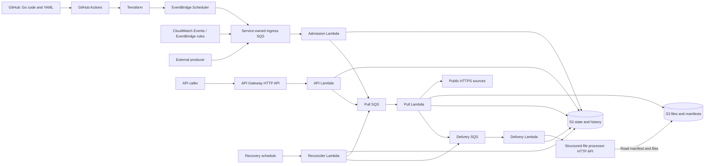
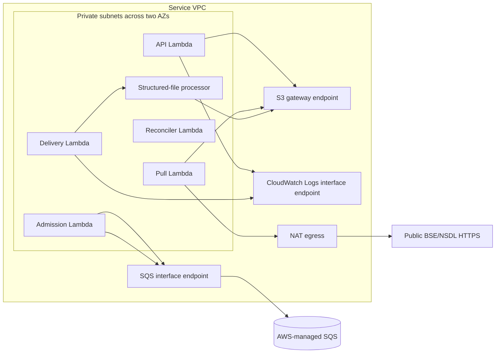
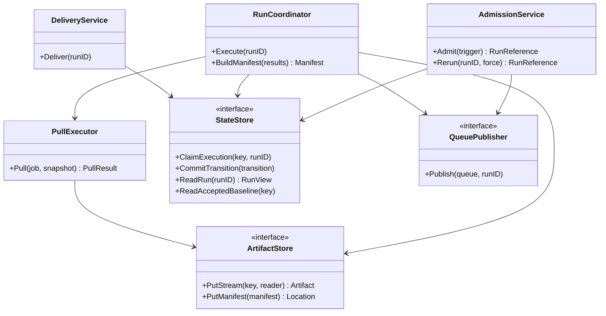
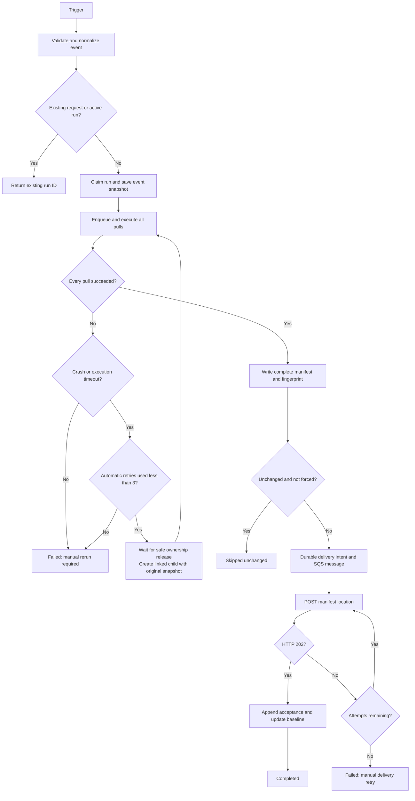
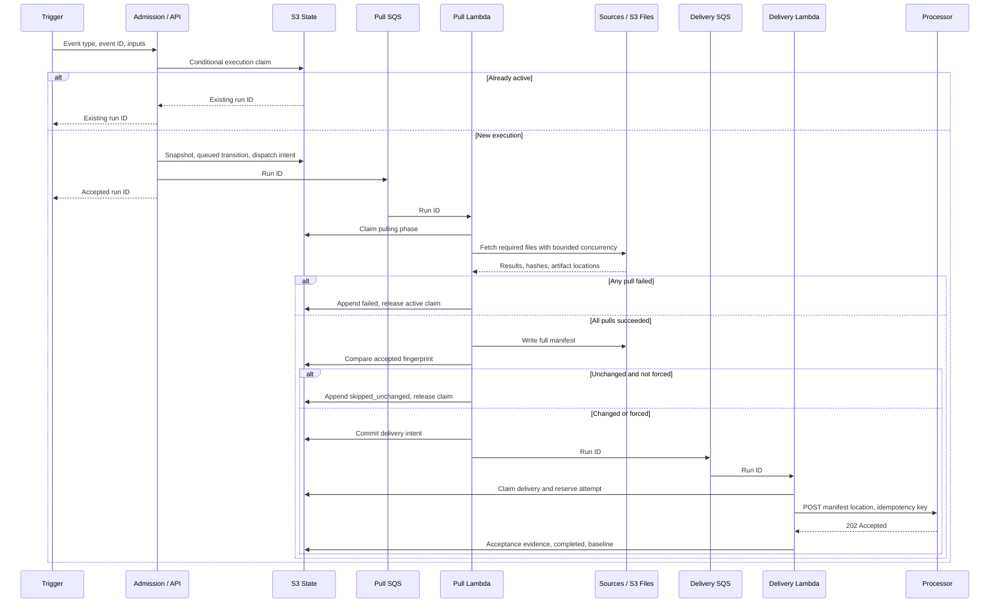

# Data Puller Service — Low-Level Design

Status: design decisions agreed; implementation and deployment validation outstanding. Updated: 2026-09-26.

## 1. Scope and agreed decisions

This design implements [data-puller-service-spec.md](data-puller-service-spec.md) with the subsequent decisions below. Where the earlier specification differs, this document defines the intended implementation. The separate [structured-file-processing-spec.md](structured-file-processing-spec.md) describes processing semantics; its HTTP admission endpoint and manifest ingestion are integration work for that service.

| Area | Decision |
|---|---|
| Repository and language | GitHub: https://github.com/maverickuser/data-fetch-service; Go; AWS SDK for Go v2 |
| Runtime | Standard AWS Lambda, not Lambda Managed Instances |
| Network placement | All five Lambdas run in private subnets in a VPC with no public IPs. The structured-file processor runs in the same VPC. SQS remains an AWS-managed regional service and is reached privately through a VPC interface endpoint; it is not literally deployed inside the VPC |
| Optimisation objective | Minimise measured cost per completed event; no strict batch latency target. Preserve correctness, bounded recovery, and backlog completion within retention |
| Infrastructure and deployment | Terraform, deployed through GitHub Actions |
| Deployment environment | `prod` only; GitHub Actions uses the `prod` environment and `config/environments/prod.yaml` |
| Resource naming | Prefix `data-fetch-service`; use descriptive resource suffixes only, without region, account ID, or environment suffixes |
| Ingress queue ownership | Dedicated to and owned by data-fetch-service; service Terraform creates the queue, DLQ, policies, and Admission Lambda event source mapping; exports queue URL and ARN for producers |
| Configuration | Version-controlled YAML; Terraform creates schedules from it |
| Triggers | EventBridge Scheduler and CloudWatch Events/EventBridge rules → ingress SQS, external SQS messages, manual REST API; normalize to CloudEvents 1.0 |
| Sources | Public unauthenticated HTTPS GET; no hostname allowlist |
| Formats | CSV, JSON, or ZIP containing exactly one selected CSV/JSON member |
| S3 filenames | Preserve source filenames by default; BSE extracted CSV uses `{exchangeName}_fgroup{run_date:ddMMyyyy}.csv`; ISIN-based JSON API outputs use `{isin_code}_{job_id}.json` from event inputs |
| Event completion | All required downloads must succeed before downstream handoff |
| Downstream interface | One asynchronous HTTP request containing a complete event manifest location |
| Service success | Processor returns HTTP 202; no processing completion callback |
| Deduplication | Compare complete event dataset with last handoff accepted with 202 |
| Changed data | If any file changes, hand off all files; if none change, skip |
| Manual force | `force: true` bypasses content deduplication, not active-run protection |
| Failure policy | Up to three source attempts per job per run; three delivery attempts; Pull Lambda crash/timeout gets three automatic full-event retries after the initial execution |
| Active duplicates | Return the existing active run ID for the same event and inputs |
| State storage | S3; append-only history, with mutable coordination objects as an exception |
| Observability | REST APIs for event snapshots, status, attempts, active runs, and date-based history |
| Retention | Files, manifests, run history, and snapshots: 30 days |
| Long-lived metadata | Latest accepted fingerprint and compact coordination state survive file expiry |
| API authentication | None initially; source configuration remains repository-managed |
| Test gates | Unit statement coverage strictly greater than 95%; mocked API integration tests; real-dependency smoke tests, all executed through GitHub Actions |

Important changes from the earlier specification: replace per-file `raw-file-ready` handoff with a complete event manifest; replace “last successfully processed” with “last HTTP-accepted handoff”; group download success is an intermediate state, not final service completion.

## 2. Component block diagram



Each SQS queue has a dead-letter queue. All Lambdas emit structured logs and metrics to CloudWatch. These connections are omitted from the diagram for readability.

### VPC runtime topology



SQS is a regional AWS-managed service, so the queue itself is outside the VPC; the interface endpoint provides private VPC access. The Lambda event-source mapping is still managed by AWS and does not require a public route.

All five Lambda functions are attached to private subnets in at least two Availability Zones. They do not receive public IP addresses and have no inbound security-group rules. A dedicated security group permits outbound HTTPS (TCP 443) to the VPC endpoints and the structured-file processor security group; no broad inbound access is required. The structured-file processor is deployed in the same VPC and uses private service-to-service addressing.

The service uses these private connectivity paths:

- An S3 gateway endpoint for artifact and state buckets, restricted by endpoint policy to the two service buckets.
- Interface endpoints for SQS and CloudWatch Logs, with private DNS enabled. Endpoint security groups allow TCP 443 from the Lambda security group only. SQS event-source mappings remain an AWS control-plane integration; the Lambda code's SDK calls use the SQS endpoint.
- The BSE and NSDL public HTTPS endpoints are reached through configurable NAT egress from the private subnets. Delivery to the processor stays inside the VPC and does not use NAT. If a source later becomes privately reachable, its route can be changed without changing the application contract.

Terraform receives the VPC ID, private subnet IDs, Availability Zone mapping, and processor security-group or private DNS target as deployment inputs, or creates them through an explicitly selected network module. It must not silently place a Lambda in a public subnet. Route tables, endpoint policies, NAT routes, security groups, and DNS settings are managed and validated together. VPC flow logs and endpoint metrics are enabled according to the production logging policy.

### Shared-VPC contract with structured-file processing

The VPC is owned by a separate shared-network Terraform state. The processor service and this service consume the same versioned network outputs; neither application stack creates a VPC or chooses arbitrary subnet IDs. Required outputs are `vpc_id`, private subnet IDs by Availability Zone, `fetch_lambda_security_group_id`, `processor_security_group_id`, the internal processor listener/DNS name, and the IDs of the S3/SQS/Logs endpoints. The shared-network stack owns the cross-service security-group rule allowing the fetch Lambda security group to call the processor listener on TCP 443; the processor stack owns the listener and ECS target ingress, while the fetch stack only validates the rule and consumes the output.

Terraform preconditions and CI checks must compare the VPC ID for every subnet, Lambda function, internal load balancer, processor target, and security group. The deployment fails on a mismatch. The network stack is applied first, the processor stack second, and the fetch-service stack third; the final smoke test resolves the private processor DNS name from a fetch Lambda execution and validates the TLS/API request without NAT.

### Component responsibilities

| Component | Responsibility |
|---|---|
| API Lambda | Admit manual runs, request reruns, expose read APIs |
| Admission Lambda | Validate SQS triggers and invoke the same admission logic as the API |
| Pull Lambda | Execute one complete event group with bounded concurrent jobs; prepare manifest |
| Delivery Lambda | Send the manifest location to the processor; persist acceptance or failure |
| Reconciler Lambda | Repair interrupted state commits and enqueue operations; terminate abandoned executions |
| S3 artifact bucket | Run-specific immutable downloads, extracted files, manifests |
| S3 state bucket | Snapshots, history, attempts, listings, coordination, acceptance evidence |

One group runs in one Pull Lambda invocation initially. Goroutines execute independent jobs, while one coordinator owns run-level transitions. This avoids cross-Lambda fan-in coordination. The entire download group must fit its configured Lambda budget; exceeding that budget triggers the bounded automatic full-event retry policy; after that budget is exhausted, manual recovery is required. Larger groups would require a later architecture change.

## 3. Identity and terminology

- `event_type`: YAML definition ID, such as `nsdl-bond-data`.
- `event_id`: producer-assigned identity of one triggering event; reused on transport retries.
- `run_id`: service-generated execution ID. One event may have several linked runs through automatic execution retries or manual reruns.
- `pull_job_id`: configured endpoint ID within the event.
- `execution_key`: SHA-256 of canonical JSON containing `event_type` and normalized, resolved inputs. It identifies overlapping work, independent of `event_id` and `force`.
- `request_key`: hash of producer namespace and `event_id`, or the manual API idempotency key. It prevents transport redelivery from creating fresh runs after a run finishes.
- `config_revision`: SHA-256 of the effective configuration plus deployment Git commit.
- `parent_run_id`: prior run for an automatic execution retry, manual rerun, or delivery retry.
- `retry_root_run_id` and `execution_retry_index`: identify an automatic execution chain and its retry index (0 for initial execution, 1–3 for automatic retries).

Normalize inputs against the YAML schema. Sort JSON object keys deterministically; preserve array order and string case unless the schema explicitly normalizes a value. Resolve date variables once from the trigger's logical time and timezone. A rerun preserves those resolved values instead of recalculating today's date.

Different configuration revisions do not bypass an active run with the same execution key. After that run ends, configuration differences participate in content deduplication.

## 4. Repository and Go packages

```text
cmd/
  api/                  # Lambda entry points
  admission/
  pull/
  delivery/
  reconciler/
  configcheck/          # YAML validation and effective-config compilation
internal/
  domain/               # Event, Run, PullResult, Manifest, Transition
  config/               # Typed configuration, validation, template resolution
  admission/            # Input normalization, idempotency, active-run claims
  orchestration/        # Group execution and completion gate
  acquisition/          # HTTP fetch, bounded validation, ZIP selection, hashing
  state/                # Immutable records, conditional coordination, recovery
  storage/              # S3 streaming and multipart handling
  delivery/             # HTTP handoff and attempt budget
  api/                  # REST routes and response projections
  telemetry/            # Structured logs and metrics
config/events.yaml
config/environments/prod.yaml
infra/bootstrap/        # Terraform state bucket; deployment role supplied by user
infra/service/          # Runtime resources
docs/
.github/workflows/
```

Keep business logic independent of Lambda adapters. Use interfaces for S3 state, artifact storage, queues, HTTP clients, clock, and ID generation so failures can be tested deterministically.



## 5. YAML configuration

Example schema, with proposed operational defaults. Resource sizing and limits below are initial values to verify under load, not measured capacity guarantees.

```yaml
schema_version: 1
defaults:
  pull_concurrency: 3
  request_timeout_seconds: 120
  source_max_attempts: 3
  pull_execution_max_retries: 3        # three retries after initial execution; four runs total
  max_download_bytes: 1073741824       # 1 GiB per response
  max_extracted_bytes: 4294967296      # 4 GiB selected ZIP member
  max_zip_entries: 10000
  max_compression_ratio: 100
  max_validation_token_bytes: 1048576  # bound individual field/string buffering
processor:
  enabled: false
  url: "https://processor.example.invalid/v1/event-ingestions"
  request_timeout_seconds: 30
  max_attempts: 3
events:
  - id: daily-bhavcopy
    enabled: true
    dataset_type: urn:bond-platform:dataset:bse-debt-trades
    timezone: Asia/Kolkata
    inputs:
      exchangeName:
        type: string
        required: true
        pattern: "^[A-Za-z0-9-]+$"
      run_date:
        type: date
        default: trigger_date
    schedule:
      enabled: true
      expression: "cron(0 20 ? * MON-FRI *)" # agreed: 20:00 IST, Monday through Friday
      timezone: Asia/Kolkata
      inputs:
        exchangeName: BSE
    jobs:
      - id: debt-bhavcopy
        request:
          method: GET
          url_template: "https://www.bseindia.com/download/BhavCopy/Debt/{file_name}"
          variables:
            file_name:
              template: "DEBTBHAVCOPY{run_date:ddMMyyyy}.zip"
        response:
          format: zip
          extraction:
            member_path: "fgroup{run_date:ddMMyyyy}.csv"
            format: csv
            filename_template: "{exchangeName}_fgroup{run_date:ddMMyyyy}.csv"
  - id: nsdl-bond-data
    enabled: true
    dataset_type: urn:bond-platform:dataset:nsdl-security
    schedule:
      enabled: false
    inputs:
      isin_code:
        type: string
        required: true
        pattern: "^[A-Z0-9]{12}$"
    jobs:
      - id: isin-details
        request:
          method: GET
          url_template: "https://www.indiabondinfo.nsdl.com/bds-service/v1/public/isins?isin={isin_code}"
        response:
          format: json
          filename_template: "{isin_code}_isin-details.json"
      - id: instrument-details
        request:
          method: GET
          url_template: "https://www.indiabondinfo.nsdl.com/bds-service/v1/public/bdsinfo/instruments?isin={isin_code}"
        response:
          format: json
          filename_template: "{isin_code}_instrument-details.json"
      - id: coupon-details
        request:
          method: GET
          url_template: "https://www.indiabondinfo.nsdl.com/bds-service/v1/public/bdsinfo/coupondetail?isin={isin_code}"
        response:
          format: json
          filename_template: "{isin_code}_coupon-details.json"
      - id: redemptions
        request:
          method: GET
          url_template: "https://www.indiabondinfo.nsdl.com/bds-service/v1/public/bdsinfo/redemptions?isin={isin_code}"
        response:
          format: json
          filename_template: "{isin_code}_redemptions.json"
      - id: listings
        request:
          method: GET
          url_template: "https://www.indiabondinfo.nsdl.com/bds-service/v1/public/bdsinfo/listings?isin={isin_code}"
        response:
          format: json
          filename_template: "{isin_code}_listings.json"
      - id: credit-ratings
        request:
          method: GET
          url_template: "https://www.indiabondinfo.nsdl.com/bds-service/v1/public/bdsinfo/credit-ratings?isin={isin_code}"
        response:
          format: json
          filename_template: "{isin_code}_credit-ratings.json"
```

Agreed initial event scope and trigger assignment:

| Event | Normal trigger | Input and execution |
|---|---|---|
| `daily-bhavcopy` | EventBridge Scheduler → ingress SQS at 20:00 IST, Monday through Friday | Resolve `run_date` from scheduled time in `Asia/Kolkata`; pull the BSE debt bhavcopy. Use `cron(0 20 ? * MON-FRI *)` with timezone `Asia/Kolkata` and flexible time window disabled. This weekday schedule does not exclude exchange holidays. |
| `nsdl-bond-data` | External CloudEvents message in ingress SQS; no recurring schedule | Require `data.inputs.isin_code`; execute the complete configured NSDL API job set for that ISIN and store separate JSON files named with the ISIN and job suffix. |

Manual run/rerun APIs remain available for both events. The NSDL configuration above includes all six jobs from the functional specification, each producing a separate ISIN-prefixed JSON file. A single-job event follows exactly the same lifecycle as a multi-job event.

Agreed BSE holiday/missing-file policy: run at 20:00 IST every Monday through Friday, including exchange holidays; no holiday calendar is applied. If the source returns HTTP 404, record the job and run as failed without retrying that deterministic response, and do not hand off to the processor. Recovery requires a manual rerun preserving the original `run_date`; there is no automatic next-day recovery or fallback to a previous trading day's file. Transient source failures retain the standard bounded retry policy.

Expected business trigger chain: after bhavcopy is pulled and processed, the surrounding system checks whether each ISIN is already present and publishes an NSDL request for missing ISINs. This produces an initial high-volume batch, expected to decrease as ISIN coverage grows. For this service, those requests remain external ingress events; the existing design does not add ISIN master-data lookup or processor-completion polling to the puller. Size and test for burst arrivals, including an initial batch near 10,000 events, rather than assuming evenly distributed daily traffic. There is no strict batch completion latency target. Favour conservative queue-consumer concurrency, reliable processing, and verified upstream limits; validate that backlog drains within queue retention and monitor oldest-message age. Per-source timeouts, ownership deadlines, and bounded retries still apply.

ZIP job response configuration:

```yaml
response:
  format: zip
  extraction:
    member_path: "reports/prices_{run_date:yyyyMMdd}.csv"
    format: csv
```

Validation rejects duplicate IDs, undeclared variables, executable expressions, unsupported methods/formats, invalid limits, and schedules without all required inputs or defaults. Host and scheme are fixed configuration; runtime values cannot replace them. Encode path and query values in their respective URL contexts. ZIP member paths are not URL-encoded.

GitHub Actions compiles YAML and environment overlays into one canonical effective configuration. Package that revision with every Lambda and feed the same artifact to Terraform. Terraform uses `yamldecode` and `for_each` to create enabled schedules; no console-managed duplicate schedules. Deployment ordering and backward-compatible config readers must allow queued requests to finish against their stored snapshot.

Agreed: keep the processor URL configurable through `processor.url` in the version-controlled environment overlay; no real endpoint is required to start implementation. The processor URL is a placeholder initially. While `processor.enabled: false`, successful downloads produce a manifest and then fail with `PROCESSOR_NOT_CONFIGURED`; they never create a false 202 acceptance or deduplication baseline. A later explicit delivery retry can select the newly deployed processor configuration and records that change in its snapshot.

The BSE download URL is repository-managed configuration: combine `request.url_template` with `file_name`, rendered from the resolved `run_date`. Use the scheduled occurrence's Asia/Kolkata date, not the worker's current date; manual runs can supply a historical `run_date`. The agreed source pattern is `https://www.bseindia.com/download/BhavCopy/Debt/DEBTBHAVCOPY{run_date:ddMMyyyy}.zip`. For 21 September 2026 this resolves to `DEBTBHAVCOPY21092026.zip`. Preserve the archive filename in S3; prefix the extracted CSV filename with the event's `exchangeName`.

The supplied 21 September archive was downloaded and inspected: it contains `fgroup21092026.csv`, `icdm21092026.csv`, and `wdm21092026.csv`. Agreed selection: extract only `fgroup{run_date:ddMMyyyy}.csv`, using the same resolved run date as the archive URL. Store it as `{exchangeName}_fgroup{run_date:ddMMyyyy}.csv`, taking `exchangeName` from the event inputs and preserving its case. The BSE event manifest contains exactly one processing file entry, referencing the extracted fgroup CSV; exclude the archive, icdm, and wdm files from processing inputs. If the exact fgroup member is missing, fail the job under the existing ZIP selection policy.

## 6. Trigger and snapshot contracts

Agreed contract: CloudEvents 1.0 structured JSON is the canonical event envelope. External producers place it in the SQS message body. AWS-native CloudWatch Events/EventBridge envelopes are also accepted through the adapter below; they are not themselves CloudEvents.

```json
{
  "specversion": "1.0",
  "id": "evt_001",
  "source": "urn:bond-platform",
  "type": "com.bondplatform.data.pull.requested.v1",
  "time": "2026-09-26T10:00:00Z",
  "subject": "isin/INE831R08076",
  "datacontenttype": "application/json",
  "data": {
    "schema_version": 1,
    "event_type": "nsdl-bond-data",
    "inputs": {"isin_code": "INE831R08076"}
  }
}
```

Require the CloudEvents attributes `specversion`, `id`, `source`, and `type`; this service additionally requires RFC3339 `time`, `datacontenttype: application/json`, and the illustrated `data` schema. `subject` is optional; `data.inputs` is authoritative for the ISIN. Validate the supported type and payload version before admission. The envelope version and business payload version are independent.

Map `source` to the internal producer namespace, `id` to `event_id`, `time` to `occurred_at`, and `data.event_type`/`data.inputs` to the existing domain fields. Hash the canonical pair `(source, id)` for external request identity. Preserve both values on retries; never use the SQS message ID or receipt handle as business identity. Request lookup uses the URL-encoded source as its producer parameter.

### AWS transport adapters

- **SQS:** unwrap each Lambda `Records[].body`, then validate its CloudEvents JSON or normalize a supported native EventBridge envelope. Preserve transport metadata separately from the canonical request payload so delivery-attempt metadata cannot create payload conflicts.
- **EventBridge Scheduler:** Terraform supplies a CloudEvents target payload to ingress SQS. Set `source` to `<aws.scheduler.schedule-arn>` and both `id` and `time` to `<aws.scheduler.scheduled-time>`. Populate `data.event_type` and `data.inputs` from YAML and include `data.schedule_arn` and `data.scheduled_time` using the same placeholders. Thus `(source, id)` identifies one scheduled occurrence. Do not use Scheduler execution ID or attempt number for identity.
- **CloudWatch Events / EventBridge rules:** target ingress SQS with the native event envelope. For native scheduled events (`source: aws.events`, `detail-type: Scheduled Event`), map the configured rule ARN from `resources` to CloudEvents `source`, and event `time` to both `id` and `time`. A repository-managed rule-ARN mapping supplies `data.event_type` and configured inputs because native scheduled-event `detail` can be empty. For other native events, require an explicit repository-managed mapping of account, region, source, and detail-type to an event definition and input fields; derive the CloudEvents source as `urn:aws:eventbridge:{account}:{region}:{source}`, preserve the native `id` and `time`, and map approved detail fields into `data.inputs`. Reject unmapped events. Preserve the original envelope in the snapshot.

All three paths use the same admission logic and retain ingress SQS buffering/recovery. New service schedules use EventBridge Scheduler; native scheduled-rule support accommodates existing CloudWatch Events rules without creating duplicate schedules. The manual REST API retains its documented request body and normalizes into the same domain model. Only that API exposes `force` in v1. Resolve date inputs from logical event/scheduled time, never from later SQS delivery time.

### BSE scheduled event: exchange name, no ISIN

Agreed: the BSE scheduled event carries `exchangeName` and requires no ISIN. This supersedes the earlier empty-business-input decision. Terraform supplies the following payload inside the Scheduler CloudEvents envelope. For a CloudWatch Events/EventBridge rule, configure its target input transformation to supply the same payload while preserving rule identity and scheduled time; do not rely on an empty native `detail` for this job.

```json
{
  "schema_version": 1,
  "event_type": "daily-bhavcopy",
  "inputs": {"exchangeName": "BSE"}
}
```

`exchangeName` is required, validated as a nonempty filename-safe value, and read from event inputs rather than hardcoded in acquisition logic. Manual BSE requests also provide it. CloudEvents `subject` is omitted for BSE. Admission resolves `run_date` from the scheduled occurrence's `time` in `Asia/Kolkata`, then renders the archive URL, selected member path, and output filename. For 21 September 2026 with `exchangeName: BSE`, download `DEBTBHAVCOPY21092026.zip`, select `fgroup21092026.csv`, and store `BSE_fgroup21092026.csv`, even if queue delivery occurs after midnight. Only NSDL requires `data.inputs.isin_code`.

Admission stores an immutable snapshot before execution, containing:

- Original event ID/type, producer, inputs, and logical trigger time.
- Resolved inputs, resolved URLs/member paths and configured filename templates, required job list, and contracts.
- Trigger source, schedule identity or manual request identity, correlation ID.
- Configuration revision, processor target, limits, `force`, parent run, and run mode.
- Original and resolved configuration, with a schema version for future readers.

Repeated request keys with identical payloads return their original run mapping. A reused key with a different payload returns `409` or records an invalid SQS trigger. A fresh trigger with the same execution key joins the active run and gets its ID; record that join as an immutable trigger receipt. It does not change the active run's force flag or configuration.

## 7. S3 object layout and lifecycle

```text
artifact-bucket/
  runs/{run_id}/downloads/{job_id}/{attempt}/{source_filename}
  runs/{run_id}/raw/{job_id}/{attempt}/{raw_filename}
  runs/{run_id}/manifest.json

state-bucket/
  runs/{run_id}/snapshot.json
  runs/{run_id}/history/{sequence-020d}.json
  runs/{run_id}/pulls/{job_id}/attempts/{attempt}/started.json
  runs/{run_id}/pulls/{job_id}/attempts/{attempt}/finished.json
  runs/{run_id}/pulls/{job_id}/result.json
  runs/{run_id}/delivery/{attempt}/started.json
  runs/{run_id}/delivery/{attempt}/finished.json
  requests/{request_key}/intent.json
  requests/{request_key}/resolution.json
  listings/{event_type}/{yyyy-mm-dd}/{created_at}-{run_id}.json
  coordination/{execution_key}.json
  acceptance/{execution_key}/{run_id}.json
```

All objects except `coordination/` are created conditionally with `If-None-Match: *`. On collision, read and verify the existing record; an identical retry is a no-op, differing bytes are an integrity error. S3 ETags are opaque concurrency tokens, not our SHA-256 content hashes.

Direct responses may use the same object as their download and raw artifact to avoid a second copy. ZIP jobs preserve the archive and selected member independently. Multipart uploads have bounded buffers, are aborted on failure, and have a lifecycle rule to remove abandoned uploads after one day. Successful manifests only reference completed, validated objects.

### Source filename preservation

Preserve the source filename instead of renaming every file to `data.csv`, `data.json`, or `response.*`:

- For direct CSV/JSON and downloaded ZIP archives, use the basename of the resolved source URL path when it has the configured format's extension (case-insensitive match), preserving the filename's case. Exclude the query string and fragment; percent-decode the final path segment once.
- JSON API jobs for ISIN events must configure `response.filename_template` using the event's `isin_code` and a job-specific suffix, for example `{isin_code}_isin-details.json` and `{isin_code}_credit-ratings.json`. This explicit template takes precedence over URL/header filenames. Resolve it from validated event inputs at admission and persist the resulting filename in the snapshot; reruns preserve that name. For `isin_code: INE831R08076`, the details output is `INE831R08076_isin-details.json`.
- Filename templates use the same declarative input substitution as URL templates, without URL encoding or executable expressions. Reject undeclared variables, unsafe resolved filename segments, and extensions inconsistent with the configured format. An invalid explicit template fails admission rather than silently falling back.
- Without an explicit template, if the URL has no usable filename, use a valid matching filename from the HTTP `Content-Disposition` header (`filename*` preferred over `filename`). If neither supplies one, use `{job_id}.{format}` for filename-less APIs that do not require ISIN naming.
- For extracted ZIP inputs, an explicit `response.extraction.filename_template` overrides the stored output basename without changing member selection. BSE uses `{exchangeName}_fgroup{run_date:ddMMyyyy}.csv`. Resolve and validate it at admission against the extracted format and save it in the snapshot. Without that template, use the basename of the configured selected member path, for example `reports/prices_20260924.csv` becomes `prices_20260924.csv`. Preserve the archive's own source filename separately under `downloads/`.
- Accept only a single safe filename segment: reject empty names, `.`/`..`, path separators, and control characters. An unusable URL/header candidate falls through to the next naming source. Existing ZIP member-path validation still applies before taking its basename.
- Run, job, and attempt prefixes prevent collisions even when different jobs return the same filename. Record the chosen name and actual S3 key in the pull result; manifests reference that actual key. Filename-only changes do not alter content deduplication.

Examples:

```text
runs/run_101/downloads/debt-bhavcopy/1/DEBTBHAVCOPY21092026.zip
runs/run_101/raw/debt-bhavcopy/1/BSE_fgroup21092026.csv
runs/run_101/raw/isin-details/1/INE831R08076_isin-details.json
runs/run_101/raw/credit-ratings/1/INE831R08076_credit-ratings.json
runs/run_101/downloads/prices/1/prices_20260924.zip
runs/run_101/raw/prices/1/prices_20260924.csv
```

Apply 30-day lifecycle expiry to run artifacts, run state, listings, and request receipts. S3 expiry is asynchronous; APIs treat records older than the retention window as unavailable. Request-key idempotency is guaranteed for that 30-day window. Manual delivery retry checks actual file availability and returns `410` if artifacts have expired; a full rerun is then required.

Exclude coordination and acceptance metadata from the general lifecycle. Retain the latest accepted compact evidence per execution key. The reconciler may delete superseded acceptance records after 30 days under the same ownership protocol; do not put a blanket expiry on this prefix. This preserves hashes even after old artifacts disappear. Long-lived evidence contains fingerprint, contracts, revision, and acceptance time, not a promise that old files remain readable.

## 8. Coordination and append-only state

### Coordination document

One small mutable object per execution key contains:

```json
{
  "schema_version": 1,
  "generation": 12,
  "active_run_id": "run_101",
  "phase": "pulling",
  "owner_token": "lambda-invocation-id",
  "owner_deadline": "2026-09-24T10:15:30Z",
  "last_sequence": 2,
  "pending_transition": null,
  "dispatch": {"queue": "pull", "state": "claimed"},
  "accepted_baseline": {
    "run_id": "run_099",
    "dataset_fingerprint": "sha256:...",
    "acceptance_key": "acceptance/key/run_099.json"
  }
}
```

Create with `If-None-Match: *`; update with `If-Match: <last ETag>`. A precondition failure means reread and reevaluate, never overwrite blindly. Keep an idle coordination object after completion instead of deleting it, preserving generation and baseline. S3 has no cross-object transaction; the following protocols close gaps explicitly.

### Admission and durable dispatch

1. Conditionally create the request intent with candidate run ID and normalized request. Concurrent admission of the same request converges on that intent. A completed immutable resolution maps it to the actual run, which may be an existing run instead of the candidate.
2. Claim the execution object by conditional write. Embed enough admission intent to rebuild the snapshot and listing after a crash. If an active run already exists, persist the join decision instead. Serialize admission decisions through a pending admission intent in coordination; finish its immutable request resolution before allowing a later admission or terminal release to supersede it. This prevents concurrent redeliveries from resolving the same request to different runs.
3. Persist snapshot, initial history, and listing idempotently. The reconciler repairs partially completed admission.
4. Record pending dispatch in coordination before sending a run-ID message to Pull SQS.
5. Sending and recording success cannot be atomic. A recovery pass resends pending dispatch; consumers claim the phase conditionally, so duplicate messages do not execute the job twice.

Unresolved request receipts are reconciled against coordination. An API timeout after acceptance is safe to retry using the same idempotency key. No successful API response is returned before a recoverable admission intent exists.

The reconciler paginates coordination and unresolved-request prefixes, with a bounded scan budget and a persisted scan cursor under its own coordination key. At initial low volume this avoids another index service. Scan cost and recovery delay grow with retained keys; monitor both before expanding traffic. Ordinary read APIs do not perform recovery mutations.

### Append-only transition commit

Exactly one phase owner commits run-level transitions. Parallel pull workers own separate per-job attempt paths and report results to that coordinator.

1. Conditionally reserve the next sequence and full transition payload in `pending_transition`.
2. Create the immutable history object for that sequence.
3. Conditionally finalize the new coordination phase and clear pending intent.

The next writer must finish pending intent before doing anything else. The API treats a reserved transition as committed only once its immutable object exists. Recovery can create that object from the stored payload and finish step 3. Do not infer order from wall-clock timestamps or use one shared appendable file.

### Ownership and expiry

Workers claim a phase with an invocation token and a deadline derived from the invocation's hard Lambda deadline plus a grace period. Never transfer ownership before that deadline, even if heartbeats stop. This favors waiting over concurrent side effects. Conditional ownership checks are required before manifest publication, phase changes, and HTTP attempt admission.

The reconciler completes already-persisted intents first. If a pulling invocation expires without a durably completed group, record `failed/WORKER_TERMINATED` for that execution and apply the automatic execution retry protocol below. A worker cannot commit authoritative state with an old generation. Run-specific artifact paths isolate any abandoned partial output.

### Automatic Pull Lambda execution retries

Agreed: retry a Pull Lambda crash or timeout three times after the initial execution (at most four linked runs). A controlled exit caused by exhausting the group execution budget follows the same policy. This is distinct from the three per-source HTTP attempts and the three processor delivery attempts.

1. Wait until the old invocation's hard deadline plus grace has expired before retrying an abandoned owner. A live coordinator handling a controlled budget exit must stop and join its workers before relinquishing ownership.
2. Under the execution-key conditional ownership protocol, reserve a durable retry intent containing the parent failure, root run ID, next retry index, a single generated child run ID, and the original snapshot. Finish this intent before admitting other work; never release the active execution claim between parent and child.
3. Idempotently persist the parent's terminal failure and an immutable child link, create the child snapshot/history/listing, and transfer the active claim to the child with an incremented generation and durable pull dispatch intent. Reconciliation finishes interrupted steps using the same reserved child ID; duplicate recovery or SQS delivery must not create extra children or reset the counter.
4. Publish the child run to Pull SQS through the existing recoverable dispatch protocol. Execute all jobs again with the original resolved date, inputs, exchange name/ISIN, filenames, force flag, and configuration. The new run ID isolates artifacts and attempt records. Do not resume partial downloads or combine files from different runs.
5. Each child has the normal per-job source-attempt budget; this intentional new-run budget is not granted by arbitrary SQS redelivery. On the fourth failed execution (retry index 3), release the claim and expose `EXECUTION_RETRIES_EXHAUSTED` with the underlying crash/timeout reason; subsequent recovery is manual.

Persist the child link at `runs/{parent_run_id}/automatic-retry.json` under the same immutable-write rules and 30-day retention. Run detail exposes the retry root/index, child run ID, and latest chain status so a caller holding the original run ID can follow progress. Request-key resolutions remain mapped to their original run rather than being rewritten. Automatic retries retain the same execution key, so new equivalent triggers join the active child.

Only crash/timeout execution failures get this automatic full-event retry. Deterministic source errors (including BSE 404 on holidays), validation/ZIP errors, and exhausted ordinary source retries still fail without automatic full-event rerun. If a durable delivery intent or completed-group transition already exists, repair that transition and continue delivery instead of redownloading.

For a delivery invocation interrupted during HTTP, the attempt counts toward the three-attempt budget and its outcome is `unknown`. It may be retried with the same downstream idempotency key. No design here guarantees exactly-once HTTP execution; the downstream endpoint must accept duplicate requests safely.

## 9. Run lifecycle and flow diagram

| State | Meaning |
|---|---|
| `queued` | Accepted and durably scheduled for pulling |
| `pulling` | Required jobs executing |
| `downloads_completed` | All required files validated and stored; manifest ready |
| `delivery_pending` | Changed/forced dataset awaiting HTTP handoff |
| `delivering` | HTTP delivery attempts in progress |
| `completed` | Processor returned 202 and acceptance was durably recorded |
| `skipped_unchanged` | All files match the last accepted dataset; no HTTP call |
| `failed` | Terminal failure with stage, code, message, and retry guidance |

`completed`, `skipped_unchanged`, and `failed` are terminal. Automatic execution retries and manual recovery create new runs linked to their parents; terminal histories are never rewritten.



Preserve per-job success/failure even when the group fails. Never deliver a partial manifest. A failure in one job may cancel remaining work to save resources; record those jobs as canceled, not successful. A full rerun executes every job again.

## 10. Acquisition and resource limits

### HTTP and validation

- Reuse an HTTP client with connection pooling; bound request duration, redirects, and downloaded bytes.
- Resolve and validate public destination addresses on each connection and redirect; reject loopback, private, link-local, and metadata endpoints. Runtime inputs cannot inject arbitrary destination URLs.
- Request identity content encoding and reject unsupported content encodings in v1, avoiding accidental decompression changes to preserved response bytes.
- Accept a complete successful response, reject partial-content responses, and verify declared and actual formats. HTML/error bodies are rejected even on HTTP 200.
- Store bytes unchanged; SHA-256 is computed over the raw CSV/JSON file, not parsed or normalized data.
- JSON validation must validate the full stream with bounded token/depth limits, not `ReadAll` or decoding an entire root object. A bounded streaming validator is required; built-in decoder usage must be measured for large individual strings.
- CSV validation checks syntax with configured dialect and bounded field/record sizes. CSV has no reliable magic signature; combine content type, explicit HTML rejection, and parse checks. Expected headers and business values remain processor responsibilities.
- Type/format errors, unsafe extraction, and exceeded limits are deterministic and not retried.

### ZIP extraction

**ZIP handoff requirement:** When an event's configured source file has a `.zip` extension, route it through ZIP extraction and select exactly the configured member. Require `response.format: zip` and `extraction.member_path` for that job; reject inconsistent configuration instead of forwarding the archive. Check the URL path extension independently of its query string, case-insensitively. Extensionless ZIP endpoints remain supported through explicit `response.format: zip`; validate actual archive content in every case.

The selected CSV or JSON is the only processing input contributed by that ZIP job. Never include the archive or its other members in the processor's file list. For a single-ZIP event the manifest has exactly one file entry, pointing to the extracted file in S3. For a multi-job event it contains one raw input per job, preserving the agreed complete-event handoff. The processor is not responsible for unzipping.

Download to a unique `/tmp/{run_id}/{job_id}/{attempt}/` path, preserving the original archive in S3. Go's `archive/zip` reads the local archive using random access. Match an exact case-sensitive member path; require exactly one regular file. Reject encrypted/corrupt archives, unsafe paths, selected symlinks, and configured limit violations. Stream the selected member through validation/hash into S3; check decompression size, ratio, and checksum during reading. Do not extract the whole archive or recursively unpack members.

A byte-budget semaphore limits total concurrent temporary files, in addition to the job concurrency limit. Unknown content lengths reserve the maximum allowed download size. Clean temporary files on every path; account for warm Lambda reuse. S3 objects and manifests are never considered ready until upload and validation finish.

### Initial configurable deployment values

| Setting | Initial value |
|---|---|
| Pull Lambda | 2,048 MB memory; 4,096 MB temporary storage; 900-second timeout |
| Pull execution budget | 840 seconds; remaining time reserved for state persistence and cleanup |
| Pull execution retries | 3 after initial run (4 executions total), for crashes/timeouts including group budget expiry |
| Concurrent jobs per run | 3, additionally limited by temporary storage budget |
| Admission/API Lambda | 256 MB; 30-second timeout |
| Delivery Lambda | 256 MB; 180-second timeout |
| Reconciler | 256 MB; 60-second timeout; scheduled every 5 minutes |
| Source attempts | At most 3; exponential backoff with jitter within run deadline |
| Delivery attempts | At most 3 per delivery run; 30 seconds per request |
| Queue batch size | 1 initially |
| Queue visibility | At least 6 × consuming Lambda timeout; no batching window initially |
| Queue retention / DLQ | 4 days / 14 days; infrastructure redrive threshold initially 5 |

All values are tunable. Admission checks obvious configurations that cannot fit storage limits; runtime deadlines remain authoritative. Standard Lambda supports up to 10,240 MB of `/tmp` storage and a 900-second execution limit. Queue visibility recommendations and these AWS bounds are documented in the references.

## 11. Manifest, fingerprint, and processor contract

Cost tuning applies across acquisition, state, and delivery: keep on-demand execution and the initial arm64 architecture, avoid provisioned concurrency, and benchmark memory/duration combinations against cost per completed event. Lower concurrency controls request pressure but does not by itself establish lower total cost. Measure S3 request volume from history writes, run projections, and recovery scans at the initial 10,000-event scale; retain bounded scans and avoid frequent status polling. Reuse direct-response objects where supported, stream data, and emit bounded operational logs without full response bodies. Preserve required history, acceptance evidence, retries, and real-dependency test gates. All initial resource values remain provisional until measured; do not claim that minimum memory or the S3-only design is automatically cheapest.

```json
{
  "specversion": "1.0",
  "id": "urn:bond-platform:manifest:run_101",
  "source": "urn:bond-platform:service:data-fetch-service",
  "type": "com.bondplatform.dataset.manifest.v1",
  "dataschema": "urn:bond-platform:dataset:nsdl-security",
  "time": "2026-09-27T14:30:00Z",
  "subject": "isin/INE121A07QY9",
  "datacontenttype": "application/json",
  "data": {
    "schema_version": 1,
    "event_type": "nsdl-bond-data",
    "event_id": "evt_001",
    "run_id": "run_101",
    "inputs": {"isin_code": "INE121A07QY9"},
    "config_revision": "sha256:config...",
    "dataset_fingerprint": "sha256:dataset...",
    "files": [
      {
        "job_id": "isin-details",
        "bucket": "data-fetch-service-artifacts",
        "key": "runs/run_101/raw/isin-details/1/INE121A07QY9_isin-details.json",
        "format": "json",
        "sha256": "file-hash",
        "size_bytes": 1234,
        "source_url": "https://www.indiabondinfo.nsdl.com/bds-service/v1/public/isins?isin=INE121A07QY9"
      }
    ]
  }
}
```

The manifest is a CloudEvents 1.0 event. Its `type` identifies the manifest envelope (`com.bondplatform.dataset.manifest.v1`), while `dataschema` carries the stable dataset contract URN used by downstream processing: `urn:bond-platform:dataset:nsdl-security` for the complete NSDL security dataset and `urn:bond-platform:dataset:bse-debt-trades` for the BSE daily trades dataset. `schema_version` versions the manifest data; `dataschema` selects the processor-owned YAML contract. The example shows one entry for brevity; a real NSDL manifest contains all six JSON files. The processor has IAM read access to the artifact bucket; the manifest URI does not grant access by itself.

The v1 dataset-type mapping is fixed and validated at admission:

| Manifest `dataschema` | `data.event_type` | Required file set |
|---|---|---|
| `urn:bond-platform:dataset:nsdl-security` | `nsdl-bond-data` | Six ISIN-prefixed JSON files |
| `urn:bond-platform:dataset:bse-debt-trades` | `daily-bhavcopy` | One exchange-prefixed BSE fgroup CSV |

The `dataschema` URN identifies the dataset meaning and processor rule family. The initial URNs are immutable v1 contracts; an incompatible revision gets a new URN. It is the only contract selector and is present once at the CloudEvent level; file entries never carry a `processing_contract`. `data.dataset_fingerprint` identifies the exact downloaded content set. `id` identifies one immutable manifest event/run; it is not reused across different runs.

For the BSE debt bhavcopy event, the manifest has one processing file entry. The selected member is `fgroup{ddMMyyyy}.csv`, stored under the exchange-prefixed name; the ZIP archive and the `icdm`/`wdm` members are not processing inputs. The archive and selected-member values are retained as lineage metadata so the pull can be audited without expanding `files[]`:

```json
{
  "specversion": "1.0",
  "id": "urn:bond-platform:manifest:run_101",
  "source": "urn:bond-platform:service:data-fetch-service",
  "type": "com.bondplatform.dataset.manifest.v1",
  "dataschema": "urn:bond-platform:dataset:bse-debt-trades",
  "time": "2026-09-21T14:30:00Z",
  "subject": "exchange/BSE/trade-date/2026-09-21",
  "datacontenttype": "application/json",
  "data": {
    "schema_version": 1,
    "event_type": "daily-bhavcopy",
    "event_id": "evt_bse_20260921",
    "run_id": "run_101",
    "inputs": {
      "exchangeName": "BSE",
      "tradeDate": "2026-09-21"
    },
    "config_revision": "sha256:config...",
    "dataset_fingerprint": "sha256:dataset...",
    "files": [
      {
        "job_id": "debt-bhavcopy",
        "bucket": "data-fetch-service-artifacts",
        "key": "runs/run_101/raw/debt-bhavcopy/1/BSE_fgroup21092026.csv",
        "format": "csv",
        "sha256": "sha256:file...",
        "size_bytes": 99424,
        "source_url": "https://www.bseindia.com/download/BhavCopy/Debt/DEBTBHAVCOPY21092026.zip",
        "selected_member_path": "fgroup21092026.csv"
      }
    ]
  }
}
```

`key` is the only file location the processor reads. `source_url` and `selected_member_path` are lineage metadata; they are not additional files. A BSE manifest must contain exactly one `files[]` entry, while a complete NSDL manifest contains one entry for each of its six jobs. The raw selected-file hash and the resolved `exchangeName`/`tradeDate` are included in the dataset fingerprint.

Agreed processor integration clarification (2026-09-27): BSE manifests must include both `inputs.exchangeName` and `inputs.tradeDate`, for example:

```json
{
  "exchangeName": "BSE",
  "tradeDate": "2026-01-01"
}
```

This object is the BSE manifest's `inputs` value. Copy `exchangeName` from the resolved event inputs and serialize the already resolved logical `run_date` as ISO `YYYY-MM-DD` in `tradeDate`. Preserve both through retries; never recalculate the date from delivery/worker time. This does not add a required date to the scheduled trigger: the fetch service still resolves its logical run date at admission. The processor applies these manifest values to all CSV rows and checks that they agree with `{exchangeName}_fgroup{ddMMyyyy}.csv`. Keep the resolved manifest inputs in the dataset fingerprint so a different trading date or exchange cannot be treated as an identical processing dataset. NSDL continues to use `inputs.isin_code` without a required trading date.

Compute the dataset fingerprint from canonical JSON containing the dataset `dataschema` URN, event type, normalized inputs, destination identity, and the sorted set of `(job_id, resolved_url, selected_member_path, format, raw_sha256)`. Include processing-relevant configuration, excluding timestamps, run IDs, schedules, retry limits, and temporary object paths. Adding/removing jobs, changing the dataset contract URN, changing a source, or changing the processor destination requires a fresh handoff even if bytes are identical. File entries do not carry a processing-contract field.

Compare against the latest accepted fingerprint for this execution key. No baseline means delivery is required. ZIP metadata changes alone do not count. An unchanged run still validates and stores all current files, but does not advance the accepted baseline.

HTTP request:

Authoritative admission contract: [OpenAPI JSON](data-processing-service-openapi.json) and [OpenAPI YAML](data-processing-service-openapi.yaml), API version 1.0.0 (OpenAPI 3.1.0). These are equivalent representations of one contract and take precedence over earlier draft HTTP examples. Keep both representations semantically identical and validate generated BSE/NSDL submissions and mocked responses against this contract during implementation. It defines the HTTP admission API; the stored manifest still contains `data.files`.

Client requirements: enforce the 65536-byte uncompressed UTF-8 request limit; set `Idempotency-Key` exactly to `data.run_id`; persist the full submission before sending and reuse its ID, time, inputs, and extensions on automatic retries. BSE admission requires `exchangeName: BSE` with an ISO trade date; NSDL subject uses the trimmed, uppercase ISIN. Fingerprints must be `sha256:` followed by 64 lowercase hexadecimal characters. Treat 400/409/413/415 as terminal request errors; retry 429 according to `Retry-After` and 500/503 or transport failures within the existing three-attempt delivery budget. Persist the 202 receipt (`jobId`, `status`, `eventId`, `runId`, `createdAt`, `statusUrl`) and `Location` as acceptance evidence; no mandatory status polling is introduced. S3 validation occurs asynchronously after 202, so admission success does not certify file validity.

```http
POST /v1/event-ingestions
Content-Type: application/cloudevents+json
Idempotency-Key: run_202

{
  "specversion": "1.0",
  "id": "urn:bond-platform:submission:run_202",
  "source": "urn:bond-platform:service:data-fetch-service",
  "type": "com.bondplatform.dataset.manifest.v1",
  "dataschema": "urn:bond-platform:dataset:nsdl-security",
  "time": "2026-09-27T14:30:00Z",
  "subject": "isin/INE121A07QY9",
  "datacontenttype": "application/json",
  "data": {
    "schema_version": 1,
    "event_type": "nsdl-bond-data",
    "event_id": "evt_nsdl",
    "run_id": "run_202",
    "inputs": {
      "isin_code": "INE121A07QY9"
    },
    "manifest": {
      "bucket": "data-fetch-service-artifacts",
      "key": "runs/run_202/manifest.json"
    },
    "dataset_fingerprint": "sha256:aaaaaaaaaaaaaaaaaaaaaaaaaaaaaaaaaaaaaaaaaaaaaaaaaaaaaaaaaaaaaaaa"
  }
}
```

The formal upstream request/response/error contract is [data-processing-service-openapi.json](data-processing-service-openapi.json) (OpenAPI 3.1). HTTP carries the complete CloudEvent with `data.manifest`; the immutable S3 manifest retains the previously agreed CloudEvent with `data.files`. Distinguish their IDs: `urn:bond-platform:submission:{run_id}` for HTTP and `urn:bond-platform:manifest:{run_id}` for the S3 event. A `(source, id)` pair must never identify two different payloads. Retain the same HTTP event, including `time`, across retries. The HTTP reference is `data.manifest.bucket/key`, optionally pinned by `version_id`; it is never a prefix. Dataset URN, source, type, subject, schema version, fetch event ID/type, run ID, inputs, and fingerprint must agree between submission and stored manifest. `job_id` never determines which JSON fields are extracted: the one dataset contract applies all configured paths present in every file.

Admission validates the HTTP envelope and idempotency, then atomically persists the job, immutable admission receipt, pinned processing contracts, and dispatch intent before returning `202`. S3 reads and manifest/file checks run asynchronously. Failures discovered there appear in job status/errors, not as a later HTTP rejection. HTTP request limit is 65536 UTF-8 bytes, separate from source-data limits. Responses use processor camelCase; upstream event data retains snake_case. Replays return the same receipt with admission status `ACCEPTED`, even after processing ends; the status URL provides current state. `Location` and `statusUrl` point to the public read-only job resource. HTTP errors use RFC 9457 `application/problem+json`; see the OpenAPI document for 400/409/413/415/429/500/503 responses and retry rules. There is no application authentication (`security: []`); private network placement restricts POST. Read APIs remain public and unauthenticated.


Only HTTP 202 counts as acceptance. The processor must return 202 only after durable admission and return an equivalent 202 for repeats of an accepted idempotency key. This is a required integration contract, not functionality supplied by the puller. There is no downstream status callback or polling.

After 202, persist immutable acceptance evidence, commit `completed`, and advance the baseline/release the active claim through the recoverable coordination protocol. A crash after the processor accepted but before evidence was saved can cause another HTTP attempt; reuse the same idempotency key. If all attempts have unknown outcomes, fail with `DELIVERY_OUTCOME_UNKNOWN` and leave the old baseline unchanged.

## 12. Sequence diagram



SQS send arrows are at-least-once; durable intent and reconciliation cover a crash before or after a send. External SQS producers do not receive a synchronous run-ID response; request lookup provides the mapping.

## 13. Retry and recovery matrix

| Failure | Behaviour |
|---|---|
| Invalid event/configuration | API 400/422; invalid SQS receipt recorded without source calls |
| Source network timeout, 408, 429, 5xx | Up to 3 attempts, jitter and bounded Retry-After |
| Source deterministic 4xx, malformed content, ZIP selection failure | Fail job without retry |
| BSE file unavailable (HTTP 404), including exchange holidays | Fail run; no handoff or automatic next-day recovery; manual rerun with original run date |
| One required job fails | Fail group; no processor request; manual full rerun |
| Worker crashes/times out during pulls | After ownership expiry, automatically rerun the complete event in a linked child run; 3 retries after initial execution, then manual recovery |
| Manifest ready but queue send lost | Reconciler republishes delivery intent; no redownload |
| Processor timeout or non-202 | Record result; up to 3 HTTP attempts, then failed |
| Processor is unconfigured | Explicit failure without consuming network attempts |
| Duplicate SQS message | Existing request/phase claim makes it a no-op or resumes safe bookkeeping |
| S3 transient failure | Bounded SDK retries; unresolved work remains recoverable; never mark success without state |
| HTTP accepted, local commit interrupted | Finish persisted acceptance intent; otherwise retry same HTTP idempotency key |
| Artifacts expired before delivery | Fail/410; require full manual rerun |

Reserve each attempt with an immutable `started` record before making the external request. A started attempt without a finished record counts as an unknown attempt, not a free extra retry. Disable hidden HTTP-client retries that would exceed these budgets; SDK retries for AWS storage are tracked separately.

Business failures that are durably recorded are acknowledged to SQS. Return an SQS failure only when durable bookkeeping could not be completed. Queue redelivery and DLQs address infrastructure failures; they do not grant a fresh three-attempt source budget. Reconciliation repairs enqueue gaps and abandoned state, and schedules the bounded crash/timeout execution retries above; it does not automatically rerun failed business events.

### Manual recovery modes

- Full rerun: new run, all jobs execute using the original snapshot and resolved inputs; optional force. The operator starts a fresh event to use newly deployed job configuration.
- Delivery retry: new linked run, no source requests, new immutable manifest referring to the original complete files, and a fresh three-attempt delivery budget. Use only for delivery-stage failures. Reacquire the same execution key and reject stale retry if a newer different dataset has already been accepted; use a full rerun instead.
- If the processor URL was a placeholder, delivery retry may explicitly select current processor configuration. Record old/new revision and destination in the retry snapshot.

## 14. REST API

API Gateway HTTP API fronts the Go API Lambda. No authentication initially, as agreed. Anyone with network access to the endpoint can trigger configured work and view its exposed history. Request bodies select configured events; they cannot supply arbitrary source URLs, contracts, S3 keys, or processor destinations. Use bounded bodies, pagination, concurrency, and API throttling.

| Method and path | Purpose |
|---|---|
| `POST /v1/events/{event_type}/runs` | Manual run; body `inputs`, optional `force`; optional `Idempotency-Key` header |
| `POST /v1/runs/{run_id}/reruns` | Full rerun from snapshot; body optional `force` |
| `POST /v1/runs/{run_id}/delivery-retries` | Retry failed delivery without downloads; optional `use_current_processor_config` |
| `GET /v1/runs/{run_id}` | Snapshot, derived status, timing, fingerprint, parent, and error summary |
| `GET /v1/runs/{run_id}/history` | Ordered transitions with cursor |
| `GET /v1/runs/{run_id}/pulls` | Per-job results, attempts, errors, and artifact references |
| `GET /v1/runs/{run_id}/delivery` | HTTP attempts and accepted/unknown outcome |
| `GET /v1/events/{event_type}` | Current configured event definition and revision |
| `GET /v1/events/{event_type}/runs?from=...&to=...&cursor=...&limit=...` | Date-bounded run history |
| `GET /v1/events/{event_type}/active?inputs=...` | Active run for normalized URL-encoded JSON inputs |
| `GET /v1/requests/{producer}/{event_id}` | Resolve an external trigger to its run ID |

Successful new admission returns 202 with `{run_id, status, reused:false, status_url}`. Joining an active run returns 202 with `reused:true`; replaying a completed idempotent request returns 200 with its existing result. Distinguish unknown resources (404), expired known resources (410 where evidence remains), conflicting requests (409), invalid input (400/422), and throttling (429).

All POST routes accept an optional `Idempotency-Key`; callers should supply one when retrying timed-out requests. Without it, each submitted request is a new trigger subject to active-run joining and content deduplication. Processor idempotency remains keyed by the resulting run ID regardless of this header.

Run detail includes the immutable event snapshot, not just current YAML. Do not expose raw source response bodies or unbounded HTTP error bodies in API responses.

Listings are partitioned by event type and UTC creation date. Read the immutable listing entries and project status from each run's history. Default range is one day, maximum 30 days, default limit 25, maximum 100. Cursors carry date partition, S3 continuation position, and filter version. Ordering is ascending creation time initially; do not claim database-style arbitrary sorting or efficient global status queries. Repair missing listing entries during reconciliation.

Reconstruction may cost several S3 requests per run. Paginated results and optional short-lived API caching control repeated reads. S3 avoids a database dependency, but cost must be measured; it is not guaranteed cheaper than DynamoDB for frequent status polling.

## 15. Terraform and GitHub Actions

Terraform provisions:

- Private artifact/state buckets, encryption, lifecycle policies, and prefix-scoped IAM.
- Three service-owned SQS queues (ingress, pull, and delivery), each with a DLQ, queue policies, redrive/retention/visibility settings, and Lambda event source mappings. Name the ingress queue `data-fetch-service-ingress` and its DLQ `data-fetch-service-ingress-dlq`. This service's Terraform state is the sole owner of these resources.
- Export `ingress_queue_url` and `ingress_queue_arn` as Terraform outputs for external producers. Scheduler and Admission Lambda reference the created resource directly; `INGRESS_QUEUE_ARN` and `INGRESS_QUEUE_URL` are no longer deployment inputs. External services only publish messages and must not manage this queue or attach unrelated consumers.
- Five Go Lambda functions using `provided.al2023`, initially `arm64`, with pinned build toolchain and SDK dependencies, attached to the configured private VPC subnets and Lambda security group.
- VPC networking for the runtime: private subnet route tables, S3 gateway endpoint, SQS and CloudWatch Logs interface endpoints, endpoint security groups/policies, private DNS, NAT egress for public source calls, and private security-group/DNS connectivity to the processor in the same VPC.
- API Gateway routes, integration permissions, throttling, and access logging.
- YAML-derived EventBridge schedules targeting ingress SQS, plus the internal recovery schedule.
- Configured EventBridge rule targets/mappings for supported CloudWatch Events/native EventBridge producers. Service Terraform owns the ingress queue policy and grants access to configured producer principals and EventBridge rules as required, using scoped source conditions for rule delivery. Configure Admission consumer and Scheduler sender IAM permissions; external producer stacks manage their own identity permissions to send to the exported queue ARN. Supply external producer role ARNs and any cross-account/KMS requirements during integration.
- CloudWatch log groups with 30-day retention and metrics for failed runs, pending delivery age, expired ownership, and DLQ depth.
- Processor read-role permissions or an explicit cross-account bucket-policy integration input.

Run Lambdas inside the configured VPC private subnets. Public BSE/NSDL sources are reached through the NAT egress path; S3, SQS, and CloudWatch Logs use VPC endpoints. Delivery to the structured-file processor uses private connectivity in the same VPC. Artifact buckets remain private regardless of API authentication choice. The configured processor must be reachable from the VPC before enabling real handoff.

GitHub Actions workflow:

1. Pull requests: format/lint, configuration validation, unit tests with statement coverage strictly greater than 95%, mocked API integration/contract tests, Go build, and Terraform format/validate. Run Terraform plan in a trusted context with AWS access. Unit coverage and mocked integration checks are required merge gates; live production smoke tests do not run untrusted PR code.
2. Main branch: build immutable Lambda packages and effective-config artifact identified by Git SHA.
3. Authenticate to AWS using GitHub OIDC and repository/environment-scoped role trust. Read the role ARN from the `AWS_ROLE_TO_ASSUME` repository secret and `AWS_REGION` from GitHub repository/environment variables; resolve the region with `${{ vars.AWS_REGION || 'ap-south-1' }}` and pass the same resolved region to AWS credential setup, Terraform backend initialization, and the Terraform AWS provider.
4. Require the unit/coverage and mocked integration gates for the exact deployment commit, then apply reviewed Terraform changes and deploy the matching Lambda/config revision. Also execute the real-AWS integration suite described below before deployment promotion.
5. Run mandatory post-deployment smoke tests against the deployed API, SQS/S3 resources, actual BSE/NSDL endpoints, and the configured real processor endpoint. Deployment success requires these tests to pass; mocks cannot satisfy this gate. Publish test reports and smoke run IDs as workflow artifacts. A failed smoke test marks the deployment workflow failed and prevents release promotion; it does not automatically roll back already-applied infrastructure.

Provide GitHub Actions jobs for unit/coverage, mocked API integration, real-AWS integration, build/deploy, and real-endpoint smoke testing. Run the smoke suite after each production deployment and expose a `workflow_dispatch` entry point for reruns. Preserve reports on failure as well as success. Missing processor configuration or required smoke inputs fails the smoke preflight explicitly; do not silently skip the gate or report a successful release. Code validation and packaging can proceed while those integration inputs are pending.

Bootstrap the remote Terraform state bucket separately; do not place Terraform state under the 30-day runtime lifecycle. GitHub Actions assumes the user-provided AWS deployment role through OIDC; supply its ARN via the repository secret `AWS_ROLE_TO_ASSUME`. The role must trust the selected GitHub repository/environment and have permissions for the Terraform deployment. Role creation is not part of the service deployment when the role is already provided. Serialize deployments per environment. Roll back code and configuration together. No repository or AWS resources are created by this design document.

## 16. Verification plan and acceptance criteria

### Unit tests and coverage gate

- Require aggregate Go statement coverage **strictly greater than 95%** from unit tests alone. Exactly 95% fails. Compute the weighted ratio from covered/total statements in the coverage profile, not rounded display output or an average of package percentages.
- Instrument all authored production Go packages, including Lambda adapters and packages with no tests. Exclude only test code, generated code, and third-party/vendor code; keep any exclusions explicit and reviewable. Integration or smoke coverage must not inflate the unit-test result.
- Use `go test` with the race detector and an atomic coverage profile over the complete production package list. Run tests with injected clocks, IDs, storage/queue interfaces, and HTTP clients so retry, timeout, and conflict scenarios are deterministic. Upload the coverage profile and readable report to GitHub Actions.
- Cover input normalization, event adapters, filename/date templates, ZIP member selection, streaming validation, hashes/deduplication, state transitions, ownership fencing, retry budgets, and recovery. Coverage is a minimum gate alongside behavioural assertions, not a substitute for them.

### API integration tests with mocked dependencies

- Exercise the real HTTP handlers/router and application services together using an HTTP test server. Mock external source/processor endpoints and AWS storage/queue boundaries with controllable test doubles; do not mock the domain logic under test.
- Cover every REST route: admission, status/history/listings, request lookup, manual rerun, and delivery retry. Assert response bodies/status codes, persisted snapshots, queued work, exact filenames, manifests, and processor requests. Include invalid inputs, conflicting idempotency keys, expired artifacts, pagination, duplicate events, force, and partial group failures.
- Drive the actual SQS/CloudEvents adapters and worker handlers with representative messages. Simulate source timeouts/429/5xx/404, malformed CSV/JSON, ZIP failures, processor 202/non-202/unknown outcomes, and interrupted state/dispatch commits. Verify the four-execution crash/timeout limit separately from source and delivery budgets.
- Run on every PR and deployment commit without real endpoint credentials or dependence on public-source availability. A failed assertion blocks merge/deployment.

### Real-endpoint smoke tests

- Run through GitHub Actions against the deployed production service using a BSE date selected by the availability policy below, a configured valid NSDL ISIN (`SMOKE_NSDL_ISIN`), and the configured processor URL/read identity. Keep test IDs unique and label workflow reports with the commit and resulting run IDs. Use genuine source data suitable for the processor's normal idempotent ingestion; no fabricated production business records.
- BSE smoke availability policy: capture today's date in `Asia/Kolkata` once when the smoke suite starts. Trigger a manual run with `exchangeName: BSE` and that explicit `run_date`. If it fails specifically because the archive is unavailable (HTTP 404), try the immediately preceding weekday, then continue backwards through weekdays up to three fallback dates by default (four candidate dates total). Expose `SMOKE_BSE_FALLBACK_WEEKDAYS`, default 3 and minimum 3. Skip Saturday/Sunday when generating fallback dates; do not assume a weekday is an exchange trading day. Each candidate is a fresh manual event with a distinct idempotency key, not a rerun that changes an existing snapshot. Stop at the first successful complete run. Validate the actual download, extraction, exchange-prefixed filename, private S3 object, manifest, and processor handoff using that candidate's date.
- Advance to an earlier date only for explicit source-file unavailability. Timeouts/429/5xx retain their bounded source retry policy; exhausted retries, malformed ZIP/CSV, missing fgroup member, permission failures, and processor failures fail the smoke suite rather than being hidden by date fallback. If no candidate file is available, fail with a report of every attempted date and outcome. A successful fallback report must clearly identify the selected date and that today's file was unavailable. This smoke-only policy does not change production scheduling, BSE 404 failure handling, or the original-date semantics of manual/automatic reruns.
- Send an NSDL CloudEvent to the actual ingress queue using the configured ISIN. Resolve its run through request lookup, poll to a terminal state with a bounded timeout, and validate all six real responses and their ISIN-prefixed artifact names. Verify that the deployed BSE schedule has the agreed expression, timezone, and enabled state without waiting for its next firing.
- Include at least one manual `force: true` execution to ensure content deduplication cannot bypass the real processor call. Require a recorded HTTP 202, completed status, correct manifest/file references, and the configured S3 read-access integration. A 202 establishes durable processor admission only; do not claim downstream business processing has finished.
- Dependency unavailability, invalid/expired fixtures, missing configuration, or an exceeded polling deadline fails the smoke job with diagnostics. Polling accommodates the configured run/retry deadlines; do not automatically replay the entire smoke suite to hide failures. The manual workflow can rerun it after recovery.

### AWS integration and resource validation

Use GitHub Actions to provision disposable, isolated AWS test resources and validate actual SQS delivery, IAM, S3 conditional-write conflicts, and interrupted execution recovery. These temporary fixtures are not a persistent dev deployment. Clean them up in an always-run job; isolate destructive fault injection from production queues and state. Check lifecycle rules through configuration assertions rather than waiting 30 days. Run load/resource tests through a dedicated workflow before increasing production limits.

### Behavioural acceptance criteria

Tests should target failure behaviour and externally observable contracts:

1. Concurrent equivalent triggers create one active run; all callers resolve to its ID.
2. SQS redelivery after terminal completion does not create a new run within the receipt-retention window.
3. A required pull fails: no delivery occurs; a manual rerun executes the complete group.
4. Any file changes: delivered manifest contains all required files. All unchanged: no HTTP call. Force: HTTP call occurs.
5. ZIP metadata-only change does not alter raw fingerprint; missing/duplicate members, path traversal, corrupted CRC, and extraction limits fail deterministically.
   A single-ZIP event with several archive members sends a manifest with exactly one extracted-file entry; the ZIP and unselected members are absent from processing inputs.
6. Kill execution between each conditional state operation, immutable write, and queue send; reconciliation converges without overwriting history or launching duplicate active work.
7. Processor accepts but the connection/worker fails: retry uses the same idempotency key and never claims exactly-once delivery.
8. Three unsuccessful HTTP attempts produce terminal failure; delivery retry reuses files without refetching.
9. Expired run objects return appropriate API results; retained baseline still skips unchanged data after 30 days.
10. Date-partition listing pagination has no missing/duplicate entries on a fixed dataset; snapshots remain accurate after YAML changes.
11. Load tests measure peak memory, temporary disk, CPU duration, and group completion time with large ZIPs and slow endpoints before raising limits.
12. Kill Pull Lambda during multiple jobs and across each retry-transition write: verify one child per failed execution, no overlapping owners, preserved dates/inputs, at most four executions, followable parent/child history, and no partial delivery. Confirm 404/validation failures do not enter this retry chain.
13. Validate IAM, SQS redelivery, S3 conditional-write conflicts, and lifecycle configuration against a disposable AWS environment; local emulation alone is insufficient for those guarantees.

## 17. Remaining deployment inputs

These are implementation/deployment inputs, not changes to the agreed architecture:

- Agreed GitHub repository: https://github.com/maverickuser/data-fetch-service.
- Deployment role: user-provided AWS role (ARN kept out of the repository) for GitHub Actions OIDC, supplied through the repository secret `AWS_ROLE_TO_ASSUME` during workflow setup. A standalone AWS account ID is not needed to finalise the LLD; Terraform can discover it through the authenticated AWS provider.
- AWS region: configurable through the GitHub repository/environment variable `AWS_REGION`, defaulting to `ap-south-1` (Mumbai).
- Deployment environment: `prod` only, using `config/environments/prod.yaml` and the GitHub Actions `prod` environment. Serialize all production deployments through one concurrency group.
- Ingress SQS: created and owned by this service's Terraform, dedicated to data-fetch-service, and deployed in the Lambda region. Both NSDL producer messages and BSE Scheduler messages use it. Terraform owns its DLQ, access, visibility, and retention configuration and exports its URL/ARN. Remaining integration input: external producer identities for send permissions; no externally supplied queue is required.
- Agreed resource prefix: `data-fetch-service`, without region, account ID, or environment suffixes. Artifact bucket: `data-fetch-service-artifacts`; state/history bucket: `data-fetch-service-state`; separate Terraform backend bucket: `data-fetch-service-terraform-state`. Queues and Lambda functions use descriptive suffixes under the same prefix. Bucket name availability must be checked during deployment; a collision requires an explicit naming adjustment, not an automatically appended account/region suffix.
- Real processor URL/private DNS target and the AWS identity allowed to read its manifests/files. The processor must run in the same VPC as this service and allow inbound TCP 443 from the Lambda security group.
- VPC ID, private subnet IDs in at least two Availability Zones, route-table ownership, processor security-group/private-DNS target, and NAT gateway sizing/ownership for public BSE/NSDL egress.
- Real-endpoint smoke inputs: `SMOKE_NSDL_ISIN=INE121A07QY9` (user-supplied; real responses to be verified during integration) and downstream processor admission/read access. BSE starts with the current IST date and uses at least three earlier-weekday availability fallbacks as defined above; a manually supplied published date is not required.
- Initial volume: approximately 10,000 NSDL events/day (60,000 source calls/day before retries and smoke tests), plus one BSE event per scheduled weekday. Source sizes, burst distribution, and upstream request limits still need validation to tune concurrency, timeouts, and file limits. Load tests must measure aggregate source request rate, queue age, S3 request cost, and reconciler scan delay at this volume; per-run concurrency alone does not cap aggregate calls across Lambda invocations.
- Initial job configuration is specified above for BSE debt bhavcopy and all six NSDL API calls; the processor selects its YAML contract using the manifest `dataschema` URN. `event_type`, `job_id`, and `format` are validated source metadata and support routing and traceability. BSE runs at 20:00 Asia/Kolkata, Monday through Friday; NSDL is externally SQS-triggered and has no recurring schedule.
- Source/rule mappings for any existing CloudWatch Events/EventBridge producers; the CloudEvents envelope and Scheduler mapping in section 6 are agreed.

## 18. AWS references

- [S3 strong consistency](https://aws.amazon.com/s3/consistency/): reads and listings after completed writes.
- [S3 conditional writes](https://docs.aws.amazon.com/AmazonS3/latest/userguide/conditional-writes.html): object creation and ETag-based update preconditions.
- [Lambda ephemeral storage](https://docs.aws.amazon.com/lambda/latest/dg/configuration-ephemeral-storage.html): configurable temporary storage.
- [Lambda quotas](https://docs.aws.amazon.com/lambda/latest/dg/gettingstarted-limits.html): standard execution limits.
- [Lambda with SQS configuration](https://docs.aws.amazon.com/lambda/latest/dg/services-sqs-configure.html): visibility timeout and event source setup.
- [EventBridge schedule types](https://docs.aws.amazon.com/scheduler/latest/UserGuide/schedule-types.html): cron expressions and timezones.
- [Go on Lambda](https://docs.aws.amazon.com/lambda/latest/dg/lambda-golang.html): runtime and packaging.
